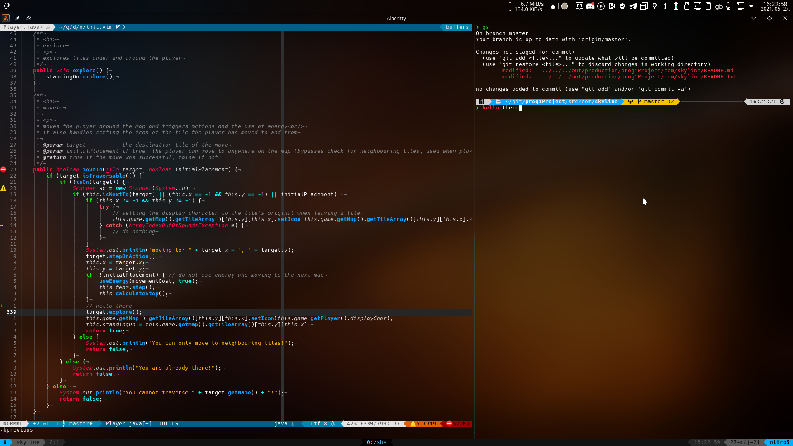

# My Dotfiles

My dotfiles for: zsh (with Oh-My-Zsh), vim and tmux,
but here are my settings for konsole(with fonts and all) and latte-dock aswell.

## installation

```shell
cd $HOME
mkdir Projects
cd Projects/
pacman -S git
git clone https://gitlab.com/skylineone044/dotfiles
cd dotfiles
chmod +x *.sh
bash setup.sh
```

neovim color scheme is at [https://github.com/skylineone044/nvim-highlite](https://github.com/skylineone044/nvim-highlite)
the setup script automatically installs it as well

## Screenshot


