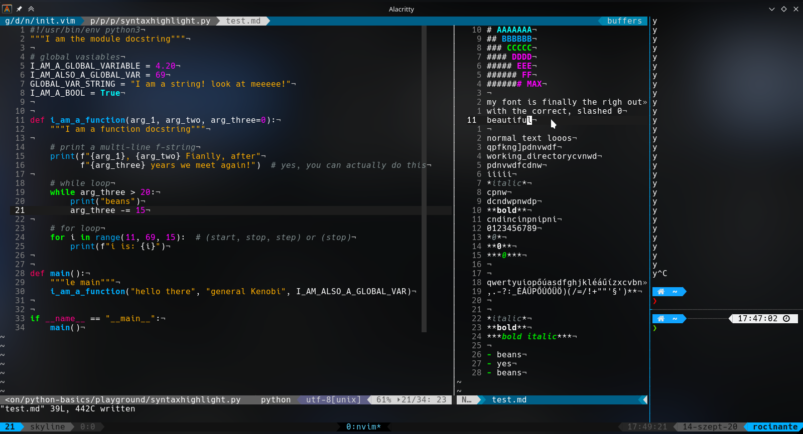

# My Dotfiles

My dotfiles for: zsh (with Oh-My-Zsh), vim and tmux, 
but here are my settings for konsole(with fonts and all) and latte-dock aswell.

use **setup.sh** to *download and install*.

## Screenshot

